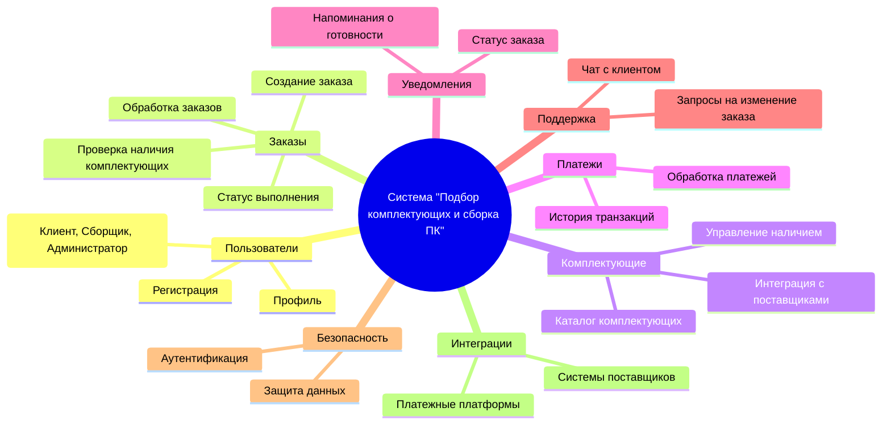
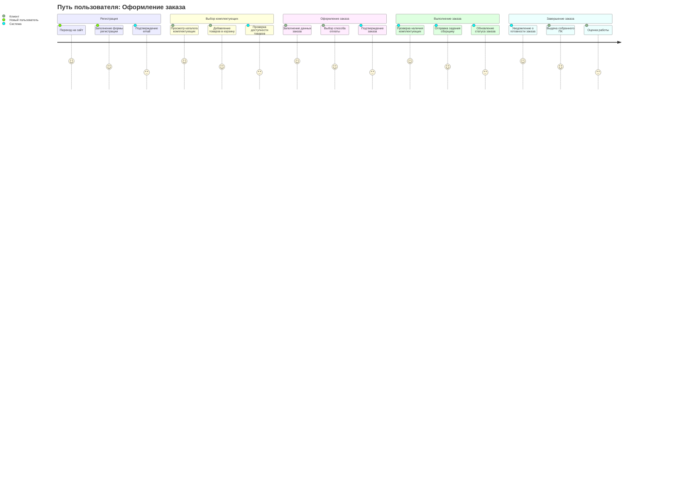

## Система "Подбор комплектующих и сборка ПК"

В этом документе представлены диаграммы, описывающие архитектуру и функциональность системы. Они включают **Mind Map**, **User Journey Diagram**, **Quadrant Chart** и **Gitgraph**, что позволяет получить полное представление о системе.

---

## 1. Mind Map

Диаграмма **Mind Map** визуализирует функциональные возможности системы, организованные по ключевым модулям.



### Описание:
- **Пользователи:** Регистрация, управление профилями и роли для клиентов, сборщиков и администраторов.
- **Заказы:** Жизненный цикл заказа, включая создание, проверку, обработку и обновление статуса.
- **Комплектующие:** Каталог, управление наличием и интеграция с внешними поставщиками.
- **Платежи:** Прием и управление транзакциями.
- **Уведомления:** Уведомления о статусе заказа и напоминания.
- **Поддержка:** Включает чат и возможность изменять заказы.
- **Безопасность:** Обеспечение аутентификации и защиты данных.
- **Интеграции:** Связь с поставщиками и платежными системами.

---

## 2. User Journey Diagram

Диаграмма **User Journey** описывает путь клиента от регистрации до получения собранного ПК.



### Описание:
1. **Регистрация:** Клиент регистрируется в системе.
2. **Выбор комплектующих:** Пользователь добавляет детали в корзину и проверяет их доступность.
3. **Оформление заказа:** Клиент вводит данные, выбирает оплату и подтверждает заказ.
4. **Выполнение заказа:** Система проверяет наличие деталей, отправляет задание сборщику и обновляет статус.
5. **Завершение заказа:** Клиент получает ПК и оставляет обратную связь.

---

## 3. Quadrant Chart

Диаграмма **Quadrant Chart** показывает важность и срочность задач в системе.

```mermaid
quadrantChart
  title Оценка задач
  "Высокая важность" : ["Обновление базы комплектующих", "Проверка наличия"]
  "Низкая важность" : ["Отправка уведомлений"]
  "Высокая срочность" : ["Обработка заказа", "Сборка ПК"]
  "Низкая срочность" : ["Обучение сотрудников"]
```

### Описание:
- **Высокая важность:** Обновление базы комплектующих и проверка их наличия.
- **Низкая важность:** Отправка уведомлений.
- **Высокая срочность:** Обработка заказа и сборка ПК.
- **Низкая срочность:** Обучение сотрудников.

---

## 4. Gitgraph

Диаграмма **Gitgraph** отображает процесс разработки системы.


### Описание:
- **Инициализация репозитория:** Начало проекта.
- **Feature/компоненты:** Разработка API заказа и проверки комплектующих.
- **Bugfix/исправление-ошибок:** Исправление ошибок в данных.
- **Интеграция:** Добавление связи с системой поставщиков.
- **Слияние веток:** Завершение работы над фичами и исправлениями.

---

## Заключение

Данный документ представляет полный набор диаграмм, описывающих архитектуру и функциональность системы. Они помогают визуализировать структуру, взаимодействия и процесс разработки, обеспечивая ясное понимание для всех участников проекта.
